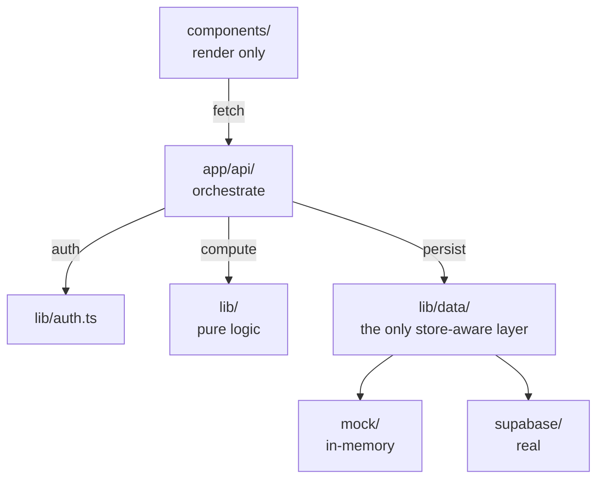
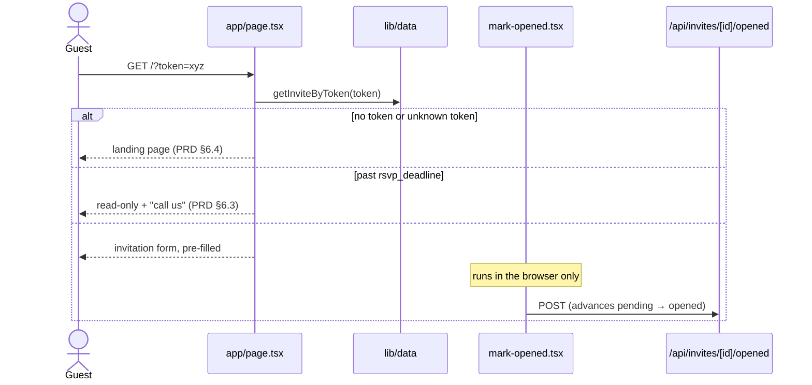
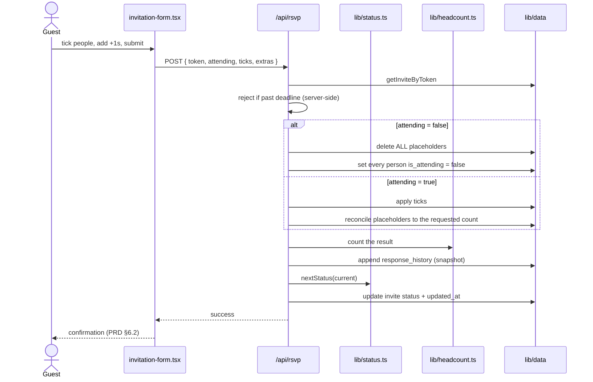
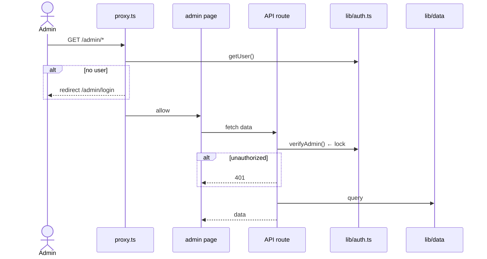
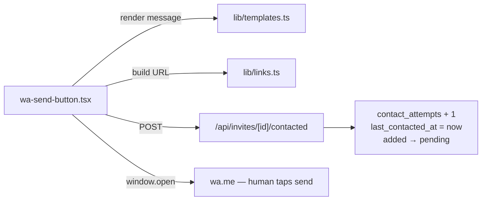
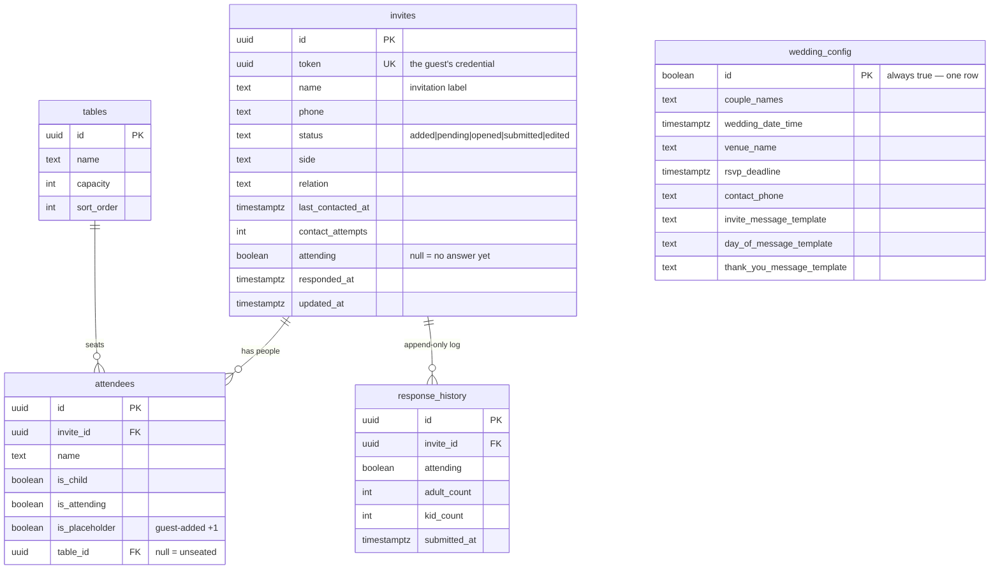
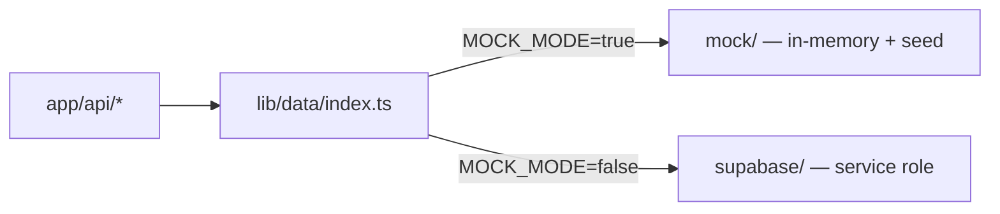

# Architecture

The structure of the app: what files exist, what each one is responsible for, and how a request moves through them.

Read `conventions.md` for the rules this structure enforces, and `wedding-rsvp-PRD.md` for what it's meant to do.

**Stack:** Next.js 16 (App Router, TypeScript) · Supabase (Postgres + Auth + Storage) · Tailwind v4

---

## 1. File structure

Every file has one job. Where the job isn't obvious from the name, §2 says what it is.

```
app/
  layout.tsx                        RTL/Hebrew shell
  page.tsx                          guest entry — landing or invitation, by token
  opengraph-image.tsx               per-guest WhatsApp preview card
  globals.css

  admin/
    layout.tsx                      admin shell + tab navigation
    page.tsx                        invitees (default tab)
    login/page.tsx
    responses/page.tsx
    stats/page.tsx
    seating/page.tsx
    settings/page.tsx

  api/
    rsvp/route.ts                   POST   guest submission
    invites/route.ts                GET    list · POST create
    invites/[id]/route.ts           GET · PATCH · DELETE
    invites/[id]/opened/route.ts    POST   client-side "opened" marking
    invites/[id]/contacted/route.ts POST   wa.me tap → attempts, timestamp, status
    invites/import/route.ts         POST   .xlsx in
    invites/export/route.ts         GET    .xlsx out
    attendees/route.ts              POST   create
    attendees/[id]/route.ts         PATCH · DELETE
    tables/route.ts                 GET · POST
    tables/[id]/route.ts            PATCH · DELETE
    config/route.ts                 GET · PATCH
    stats/route.ts                  GET
    assets/route.ts                 POST   upload to Storage

components/
  guest/
    landing-page.tsx                no token / bad token
    invitation-form.tsx             the RSVP form
    attendee-checkbox.tsx           one person's tick
    extra-guest-picker.tsx          "+1" adult/child counter
    confirmation.tsx                post-submit summary
    rsvp-closed.tsx                 read-only past the deadline
    mark-opened.tsx                 client component; fires the opened call

  admin/
    invitee-table.tsx               the main list
    invitee-row.tsx                 one invite + expand toggle
    attendee-subrow.tsx             one person under an invite
    invite-form.tsx                 add / edit
    search-bar.tsx
    status-filter.tsx
    wa-send-button.tsx
    copy-link-button.tsx
    delete-dialog.tsx               cascade confirmation
    import-button.tsx
    export-button.tsx
    history-modal.tsx
    stats-panel.tsx
    config-form.tsx
    template-editor.tsx             three templates + live preview
    asset-uploader.tsx
    seating-board.tsx
    table-card.tsx                  one table + occupancy
    unseated-list.tsx

  ui/
    status-badge.tsx
    empty-state.tsx                 ─┐
    loading-state.tsx                ├─ PRD §6.19: every list and form has all three
    error-state.tsx                 ─┘

lib/
  types.ts                          every shared type
  headcount.ts                      THE headcount formula (PRD §5.1)
  datetime.ts                       THE date formatter, pinned Asia/Jerusalem
  strings.ts                        THE Hebrew copy
  templates.ts                      {{name}} / {{link}} substitution
  status.ts                         status transition rules
  links.ts                          invite URL construction
  validation.ts                     input parsing for API routes
  bots.ts                           crawler User-Agent detection (backstop only)
  auth.ts                           verifyAdmin()
  api.ts                            ok() / badRequest() / unauthorized() helpers

  supabase/
    client.ts                       anon — Client Components
    server.ts                       anon + cookies — auth checks
    admin.ts                        service role — API routes ONLY

  data/
    index.ts                        picks the store from NEXT_PUBLIC_MOCK_MODE
    types.ts                        the interface both stores satisfy
    mock/{store,seed,index}.ts
    supabase/index.ts

proxy.ts                            gates /admin/* — lock #1
scripts/create-admin.ts             one-off; the only way an account exists
supabase/migrations/*.sql
```

## 2. Module responsibilities

| Module | Its one job | Never |
|---|---|---|
| `lib/headcount.ts` | Count attending adults and kids | Fetch anything |
| `lib/datetime.ts` | Format a date for display, `Asia/Jerusalem` | Be duplicated inline |
| `lib/strings.ts` | Hold every Hebrew string | Contain logic |
| `lib/templates.ts` | Substitute `{{name}}` / `{{link}}` | Know about WhatsApp |
| `lib/status.ts` | Decide the next status, refuse backwards moves | Write to a store |
| `lib/links.ts` | Build the invite URL from a token | Read env at call time repeatedly |
| `lib/bots.ts` | Recognise a crawler User-Agent | Be the primary defence — see §4.3 |
| `lib/auth.ts` | `verifyAdmin()` via `getUser()` | Ever use `getSession()` |
| `lib/data/*` | Persistence | Hold business rules |
| `app/api/*` | Auth → validate → call data → shape response | Hold business rules worth testing |
| `components/*` | Render | Compute headcounts or format dates |

## 3. Layers



One direction only. `lib/` never imports from `components/` or `app/`. Components never import `lib/data`.

## 4. Request flows

### 4.1 Guest opens their link



The `opened` call comes from a **Client Component**, never from the server render. WhatsApp fetches both the page and the OG image to build its preview card; server-side marking would flip every invite to `opened` the moment it was sent, destroying the "who hasn't looked yet" filter the follow-up workflow depends on (PRD §6.15). Crawlers don't run JavaScript. The User-Agent check in `lib/bots.ts` is a backstop, not the mechanism.

### 4.2 Guest submits



The deadline is enforced **here**, not only by disabling the form — a disabled form is bypassed with one `curl`.

### 4.3 Admin



Two locks on purpose. API routes are separate URLs reachable by `curl` without ever loading a page, and middleware-bypass CVEs are real and recurring (PRD §7.4).

### 4.4 Sending a WhatsApp



The app opens WhatsApp with text prepared. **It never sends.** No queue, no schedule, no batch (PRD §3.1).

## 5. Data model



**`attendees` is the only place people exist.** Guest-added +1s are rows too (`is_placeholder = true`), which is what makes them seatable and why no count columns exist anywhere.

**Seating is `attendees.table_id`, not a join table** — one person sits at one table, so it's a column. Deleting a table unseats its people rather than deleting them.

**`wedding_config.id` is `boolean primary key check (id)`** — only `true` is valid, so a second row is rejected by the database rather than by a convention someone forgets.

## 6. The mock/real swap



Callers use `getInvites()`, `submitRsvp()`. They never see a Supabase client and never know which store answered. Both satisfy the same TypeScript interface, so a missing method is a compile error, not a runtime surprise.

The previous version of this app faked the PostgREST chainable API in 221 lines. That bought only that route code *looked* identical in both modes — which is exactly what made it fragile.

## 7. Where each requirement lives

| PRD | Implemented in |
|---|---|
| §5.1 headcount | `lib/headcount.ts` — nowhere else |
| §5.2 status machine | `lib/status.ts` |
| §5.3 placeholder lifecycle | `/api/rsvp` + `lib/data` |
| §6.1 guest flow | `app/page.tsx` + `components/guest/*` |
| §6.3 deadline hard close | `/api/rsvp` (server) + `rsvp-closed.tsx` (UI) |
| §6.6 admin list | `components/admin/invitee-table.tsx` |
| §6.9 wa.me | `wa-send-button.tsx` + `/api/invites/[id]/contacted` |
| §6.15 OG + opened | `app/opengraph-image.tsx` + `mark-opened.tsx` |
| §6.17 seating | `app/admin/seating` + `components/admin/seating-board.tsx` |
| §7 security | `proxy.ts` + `lib/auth.ts` + `lib/supabase/admin.ts` |
