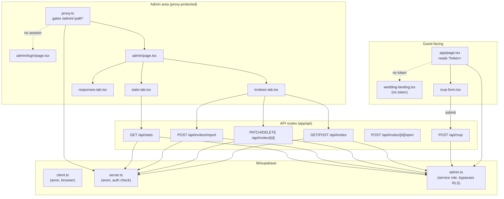
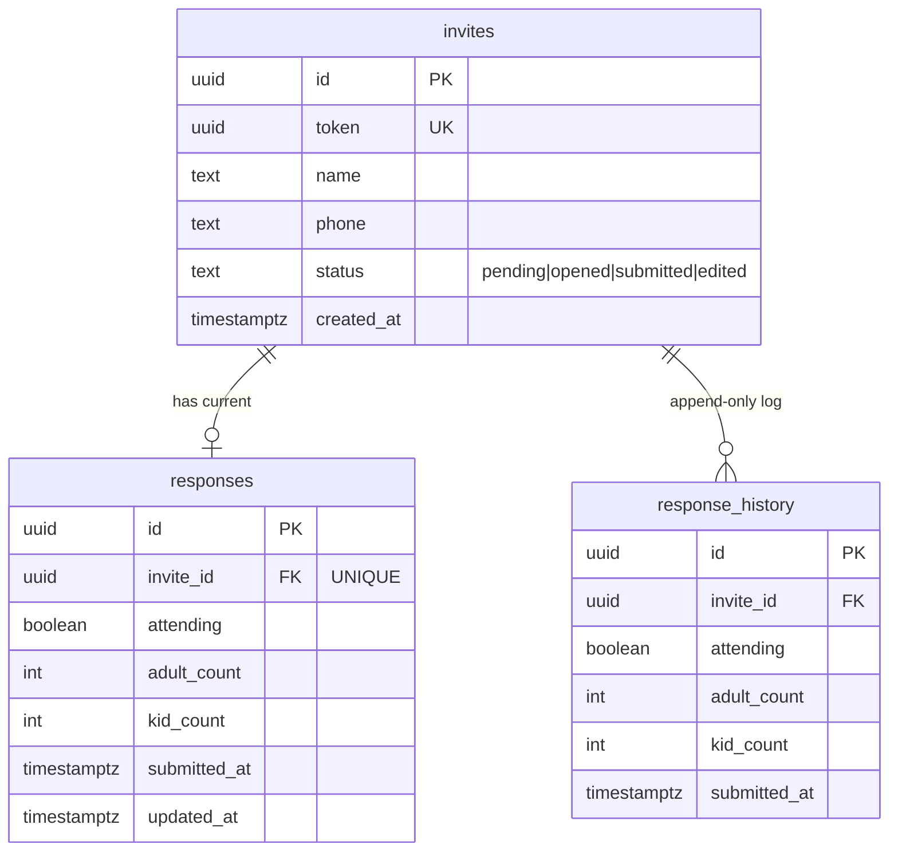
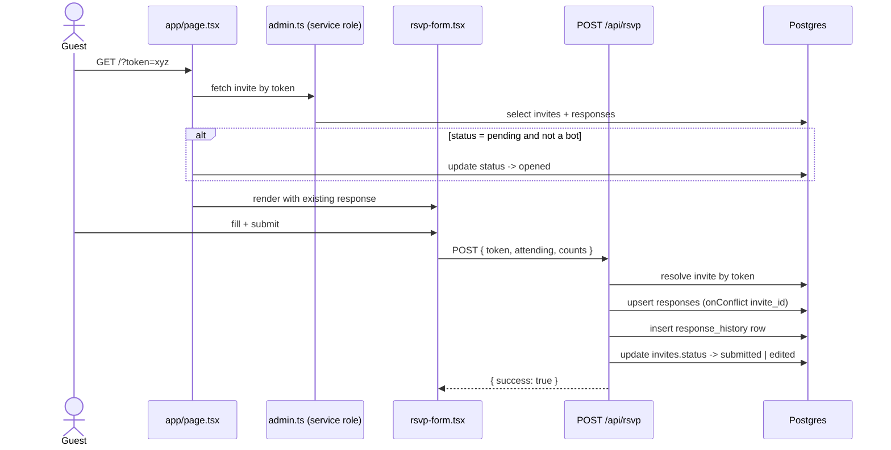
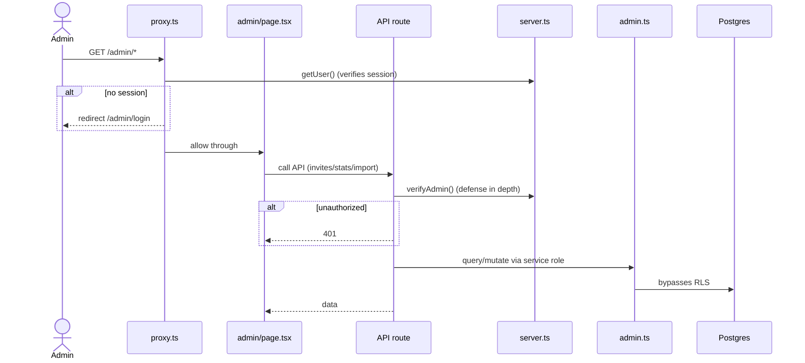

# Architecture

Stack: Next.js 16 (App Router) · Supabase (Postgres + Auth) · Tailwind v4 · shadcn/ui

## Component / Route Structure

## Data Model

Status is one-directional: `pending → opened → submitted → edited` (never reverts). RLS on all three tables is deny-all; every operation goes through `admin.ts` (service role).

## Request Flow — Guest RSVP

## Request Flow — Admin

