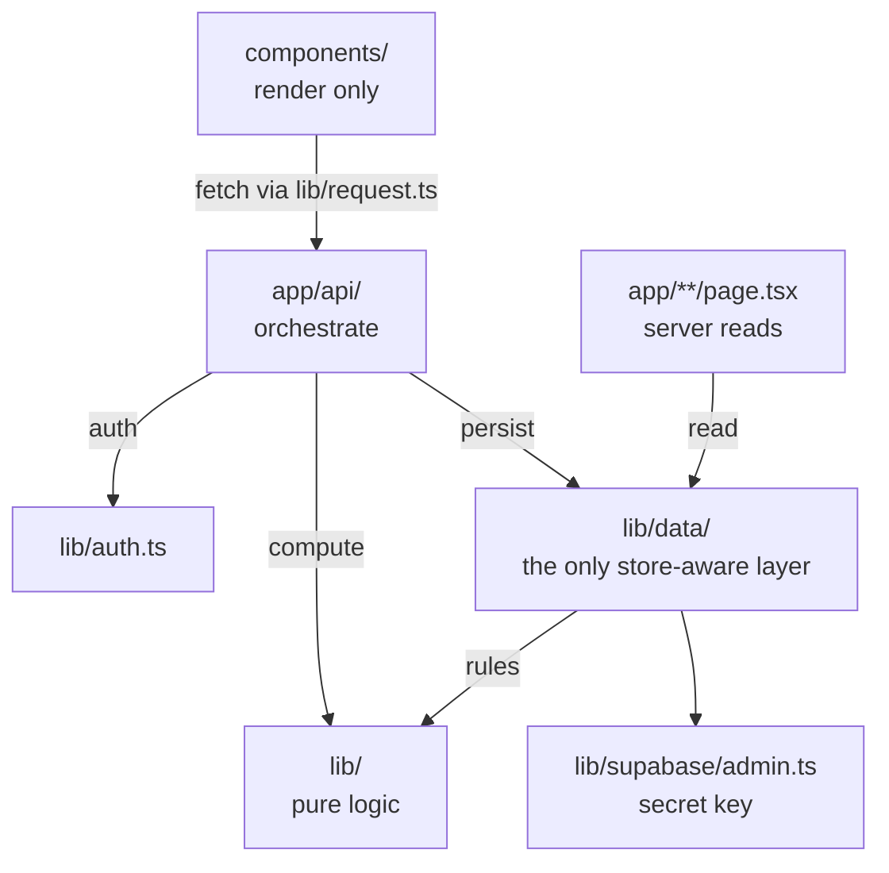
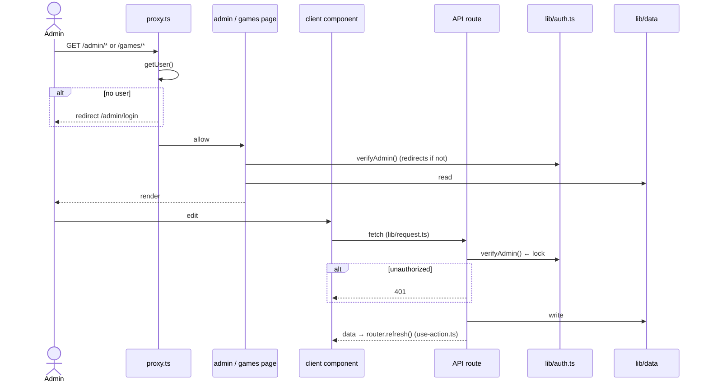
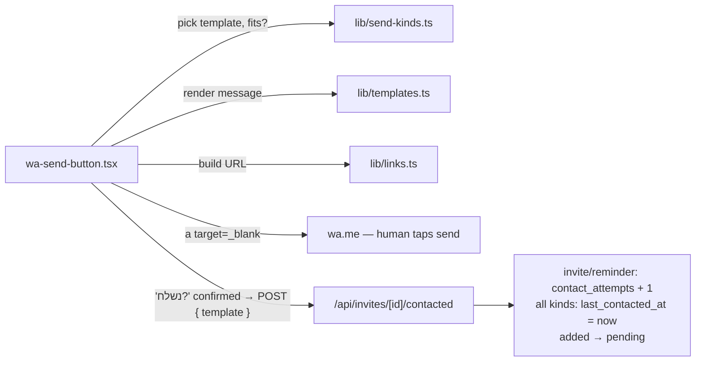
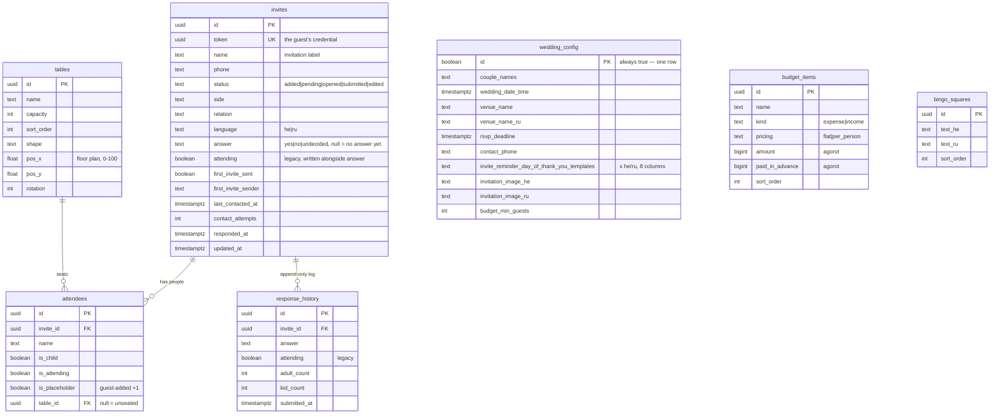
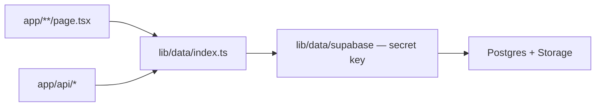

# Architecture

The structure of the app: what files exist, what each one is responsible for, and how a request moves through them.

Read `conventions.md` for the rules this structure enforces, and `wedding-rsvp-PRD.md` for what it's meant to do.

**Stack:** Next.js 16 (App Router, TypeScript) · Supabase (Postgres + Auth + Storage) · Tailwind v4

Last checked against the code: 2026-09-29.

---

## 1. File structure

Every file has one job. Where the job isn't obvious from the name, §2 says what it is.

```
app/
  layout.tsx                        RTL/Hebrew shell, Heebo font, toaster
  page.tsx                          guest entry — landing or invitation, by token; OG meta tags
  error.tsx                         guest error boundary (bilingual)
  global-error.tsx                  last resort when the root layout itself fails
  globals.css
  icon.png · apple-icon.png · favicon.ico

  admin/
    layout.tsx                      admin shell + tab navigation (draws, does not gate)
    page.tsx                        invitees (default tab) + stats tiles
    error.tsx · loading.tsx         segment error boundary / loading screen
    login/page.tsx                  the only way in; excluded from proxy matcher
    seating/page.tsx                tables, floor plan, who sits where
    budget/page.tsx                 expenses and income + totals
    photos/page.tsx                 Drive card, QR code, open switch, counter
    settings/page.tsx               wedding details, templates, invitation images
    (no responses/ or stats/ tabs: stats are tiles on the invitees
     page, history is a modal from a guest's row)

  photos/page.tsx                   PUBLIC guest upload page, gated by ?k= (docs/wedding-photos-PRD.md)

  games/                            admin-only, own shell (docs/games-bingo-PRD.md)
    layout.tsx                      vertical game list + card fonts (next/font)
    page.tsx                        redirects to /games/bingo
    error.tsx · loading.tsx         segment error boundary / loading screen
    bingo/page.tsx                  squares + printable A5 cards

  api/
    rsvp/route.ts                   POST   guest submission (no auth — token is the credential)
    calendar/route.ts               GET    wedding .ics (no auth, no guest data)
    invites/route.ts                GET    list · POST create
    invites/[id]/route.ts           GET · PATCH · DELETE
    invites/[id]/opened/route.ts    POST   client-side "opened" marking (guest, no auth)
    invites/[id]/contacted/route.ts POST   confirmed wa.me send → attempts, timestamp, status
    invites/bulk/route.ts           DELETE multi-select delete
    invites/import/route.ts         POST   .xlsx in — preview, then confirm=true writes
    invites/export/route.ts         GET    .xlsx out, import format
    invites/export/site/route.ts    POST   .xlsx in the outside RSVP site's template (ids in body)
    invites/template/route.ts       GET    empty import template
    attendees/route.ts              POST   create
    attendees/[id]/route.ts         PATCH · DELETE   (rename, adult/child, table_id)
    attendees/[id]/answer/route.ts  POST   one person's answer (admin, after a call) — no deadline
    tables/route.ts                 GET · POST
    tables/[id]/route.ts            PATCH · DELETE
    tables/export/route.ts          GET    seating plan .xlsx
    config/route.ts                 GET · PATCH
    config/image/route.ts           POST upload · PATCH activate · DELETE   invitation images
    stats/route.ts                  GET
    budget/route.ts                 GET · POST
    budget/[id]/route.ts            PATCH · DELETE
    bingo-squares/route.ts          GET · POST
    bingo-squares/[id]/route.ts     PATCH · DELETE
    photos/key/route.ts             POST   admin — regenerate the QR key
    photos/upload/route.ts          POST   PUBLIC (QR key) — one photo into Google Drive
    google/connect/route.ts         GET    admin — start the Drive OAuth (state cookie)
    google/callback/route.ts        GET    admin — store the token, create/reuse the folder
    google/disconnect/route.ts      POST   admin — forget the token, close uploads

components/
  guest/
    rsvp-screen.tsx                 decides what the sheet shows; holds the saved answer
    guest-shell.tsx                 phone-first layout: greeting · artwork · action bar
    invitation-backdrop.tsx         full-screen artwork (contain, not cover)
    rsvp-sheet.tsx                  frosted sheet over the invitation; focus handling
    invitation-form.tsx             the RSVP form: answer, ticks, +1 counts
    confirmation.tsx                post-submit summary
    rsvp-closed.tsx                 read-only past the deadline
    wedding-details.tsx             date, time, venue (pre-formatted text)
    action-bar.tsx                  RSVP · navigate · add to calendar
    mark-opened.tsx                 client component; fires the opened call
    photo-uploader.tsx              QR upload page: resize, 3 parallel uploads, he/ru toggle

  admin/
    admin-tabs.tsx                  tab navigation + games link
    sign-out-button.tsx
    invite-table.tsx                search / filter / sort state; renders rows
    invite-row.tsx                  one invitation: summary, expand, edit, delete
    attendee-list.tsx               the people on one invite
    add-invite-form.tsx             create invite, then its people
    invite-edit-form.tsx            edit an invite's own fields
    import-panel.tsx                template download, preview, confirm
    wa-send-button.tsx              opens wa.me, then asks "נשלח?" before recording
    copy-link-button.tsx
    history-modal.tsx               one invite's answer history
    config-form.tsx                 wedding details
    template-editor.tsx             one WhatsApp template + live preview
    invitation-image-form.tsx       per-language backdrop gallery
    seating-board.tsx               select-then-place seating
    table-manager.tsx               create tables
    seating-map.tsx                 draggable floor plan
    seating-printout.tsx            print / PDF seating list
    budget-table.tsx                budget lines, edited in place
    budget-totals.tsx               the four budget tiles
    budget-min-guests-field.tsx     committed minimum guest count
    photo-controls.tsx              Drive card, QR card + print sheet, open switch, new key

  games/
    games-nav.tsx                   the vertical game list
    bingo-game.tsx                  state owner: squares + optimistic edits
    bingo-square-editor.tsx         he/ru square list, per-cell save
    bingo-board.tsx                 count · language · shuffle · print
    bingo-card.tsx                  one printed card
    bingo-card.module.css           the card's print geometry

  ui/
    states.tsx                      Empty / Loading / Error states (PRD §6.19)
    route-error.tsx                 admin & games error screen, shows digest
    bilingual-error.tsx             guest error screen, Hebrew + Russian
    spinner.tsx                     in-button busy indicator
    use-action.ts                   pending state spanning request + router.refresh()

lib/
  types.ts                          every shared type
  headcount.ts                      THE headcount formula (PRD §5.1)
  status.ts                         status transition rules
  datetime.ts                       THE date formatter, pinned Asia/Jerusalem
  strings.ts                        THE copy (Hebrew, plus guest Russian)
  templates.ts                      {{name}} / {{link}} substitution
  send-kinds.ts                     invite / reminder / day-of / thank-you: who each fits
  links.ts                          invite, wa.me and navigation URLs
  phone.ts                          THE phone normaliser
  placeholders.ts                   "+1" reconciliation plan
  invite-filters.ts                 invitee search / filter / sort
  stats.ts                          dashboard numbers (groups and sums; counts via headcount)
  seating.ts                        who is seatable, table occupancy, losesSeat
  budget.ts                         budget arithmetic — the only place
  money.ts                          agorot parse / format
  bingo.ts                          seeded card dealing
  photos.ts                         upload limits, key/switch gate, rate limit
  image-resize.ts                   browser: resize on the phone (≤ 4 MB), strips EXIF/GPS
  photo-upload.ts                   browser: one XHR POST per photo, with progress
  google-drive.ts                   server-only: OAuth, token cache, folder, multipart upload
  venue.ts                          display venue vs navigation venue
  invitation-image.ts               backdrop URL per language
  calendar.ts                       THE .ics builder
  og.ts                             WhatsApp preview card shape + URL
  og-card-version.ts                GENERATED cache-busting hash
  import-format.ts                  THE spreadsheet columns and vocabularies
  import-parse.ts                   import rules: rows in, report out
  spreadsheet.ts                    .xlsx read/write (exceljs)
  site-sheet.ts                     outside RSVP site template, one row per person
  seating-plan-sheet.ts             seating arrangement .xlsx
  validation.ts                     input parsing for API routes
  bots.ts                           crawler User-Agent detection (backstop only)
  auth.ts                           verifyAdmin()
  api.ts                            ok() / badRequest() / unauthorized() … helpers
  request.ts                        client side of the API contract; one failure path

  supabase/
    client.ts                       publishable key — Client Components, auth only
    server.ts                       publishable key + cookies — auth checks
    admin.ts                        secret key — lib/data and scripts ONLY

  data/
    index.ts                        the front door; every caller imports here
    types.ts                        the DataStore interface
    supabase/index.ts               the one implementation

proxy.ts                            gates /admin/* and /games/* — lock #1
scripts/create-admin.ts             one-off; the only way an account exists
scripts/build-og-card.ts            npm run og-card: checks + publishes the preview card
supabase/migrations/001–016_*.sql   schema; 004 is test seed data — never run it
public/assets/                      invitation artwork, og-card.jpg, logo, games/
```

## 2. Module responsibilities

| Module | Its one job | Never |
|---|---|---|
| `lib/headcount.ts` | Count attending adults and kids | Fetch anything |
| `lib/datetime.ts` | Format a date for display, `Asia/Jerusalem` | Be duplicated inline |
| `lib/strings.ts` | Hold every user-facing string | Contain logic |
| `lib/templates.ts` | Substitute `{{name}}` / `{{link}}` | Know about WhatsApp |
| `lib/send-kinds.ts` | Pick a template, say which rows it fits, whether it counts as an attempt | Send anything |
| `lib/status.ts` | Decide the next status, refuse backwards moves | Write to a store |
| `lib/links.ts` | Build invite / wa.me / navigation URLs | Hardcode the origin |
| `lib/budget.ts` | Full prices and balances, in agorot | Be re-derived in a component |
| `lib/seating.ts` | Seatable people, occupancy, `losesSeat` | Count attendance itself (asks `headcount`) |
| `lib/bots.ts` | Recognise a crawler User-Agent | Be the primary defence — see §4.1 |
| `lib/auth.ts` | `verifyAdmin()` via `getUser()` | Ever use `getSession()` |
| `lib/request.ts` | Turn any API failure into one thrown Error | Import server-only code |
| `lib/data/*` | Persistence | Hold business rules |
| `app/api/*` | Auth → validate → call data → shape response | Hold business rules worth testing |
| `components/*` | Render | Compute headcounts or format dates |

## 3. Layers


```mermaid
flowchart TD
    C["components/<br/>render only"] -->|"fetch via lib/request.ts"| A["app/api/<br/>orchestrate"]
    PG["app/**/page.tsx<br/>server reads"] -->|read| D
    A -->|auth| AU["lib/auth.ts"]
    A -->|compute| L["lib/<br/>pure logic"]
    A -->|persist| D["lib/data/<br/>the only store-aware layer"]
    D -->|rules| L
    D --> SUPA["lib/supabase/admin.ts<br/>secret key"]
```

One direction only. `lib/` never imports from `components/` or `app/`. Components never import `lib/data` (a type-only import aside). Server pages read through `lib/data` directly; mutations from the browser go through `app/api`.

## 4. Request flows

### 4.1 Guest opens their link

```mermaid
sequenceDiagram
    actor G as Guest
    participant P as app/page.tsx
    participant D as lib/data
    participant M as mark-opened.tsx
    participant API as /api/invites/[id]/opened

    G->>P: GET /?token=xyz
    P->>D: getInviteByToken(token)
    alt no token, unknown or malformed token
        P-->>G: landing: artwork + action bar (PRD §6.4)
    else
        P-->>G: rsvp-screen (form, saved answer, or closed past deadline)
        Note over M: runs in the browser only, skipped once answered
        M->>API: POST (crawler UA ignored; advances to opened)
    end
```

The `opened` call comes from a **Client Component**, never from the server render. WhatsApp fetches both the page and the preview image to build its card; server-side marking would flip every invite to `opened` the moment it was sent, destroying the "who hasn't looked yet" filter the follow-up workflow depends on (PRD §6.15). Crawlers don't run JavaScript. The User-Agent check in `lib/bots.ts` is a backstop, not the mechanism.

The preview image is a static, pre-built file (`public/assets/og-card.jpg`, made by `scripts/build-og-card.ts`) advertised from `generateMetadata` in `app/page.tsx` with a `?v=` hash from `lib/og-card-version.ts`. There is no OG image route, so nothing about the preview can mutate status.

### 4.2 Guest submits

```mermaid
sequenceDiagram
    actor G as Guest
    participant F as invitation-form.tsx
    participant API as /api/rsvp
    participant D as lib/data
    participant H as lib/headcount.ts
    participant S as lib/status.ts

    G->>F: answer, tick people, add +1s, submit
    F->>API: POST { token, answer, attendingIds, extraAdults, extraKids }
    API->>API: validate; reject past deadline with 410 (server-side)
    API->>D: submitRsvp
    alt answer = yes
        D->>D: apply ticks (unticked people lose their seat)
        D->>D: reconcile placeholders (lib/placeholders.ts)
    else answer = no
        D->>D: delete placeholders, untick everyone, clear tables
    else answer = undecided
        D->>D: delete placeholders, untick everyone, keep tables
    end
    D->>H: count the result
    D->>D: append response_history (snapshot)
    D->>S: statusAfterSubmit(current)
    D->>D: update invite answer, status, updated_at
    API-->>F: success
    F-->>G: confirmation (PRD §6.2)
```

The deadline is enforced **here**, not only by disabling the form — a disabled form is bypassed with one `curl`. Which answers take a seat away is `lib/seating.ts` `losesSeat` (only a no).

### 4.3 Admin


```mermaid
sequenceDiagram
    actor A as Admin
    participant PX as proxy.ts
    participant PG as admin / games page
    participant C as client component
    participant R as API route
    participant AU as lib/auth.ts
    participant D as lib/data

    A->>PX: GET /admin/* or /games/*
    PX->>PX: getUser()
    alt no user
        PX-->>A: redirect /admin/login
    end
    PX->>PG: allow
    PG->>AU: verifyAdmin() (redirects if not)
    PG->>D: read
    PG-->>A: render
    A->>C: edit
    C->>R: fetch (lib/request.ts)
    R->>AU: verifyAdmin()  ← lock #2, independent
    alt unauthorized
        R-->>C: 401
    end
    R->>D: write
    R-->>C: data → router.refresh() (use-action.ts)
```

Two locks on purpose. API routes are separate URLs reachable by `curl` without ever loading a page, and middleware-bypass CVEs are real and recurring (PRD §7.4).

### 4.4 Sending a WhatsApp


```mermaid
flowchart LR
    T["wa-send-button.tsx"] -->|"pick template, fits?"| K["lib/send-kinds.ts"]
    T -->|render message| TPL["lib/templates.ts"]
    T -->|build URL| LNK["lib/links.ts"]
    T -->|"a target=_blank"| WA["wa.me — human taps send"]
    T -->|"'נשלח?' confirmed → POST { template }"| API["/api/invites/[id]/contacted"]
    API --> D["invite/reminder: contact_attempts + 1<br/>all kinds: last_contacted_at = now<br/>added → pending"]
```

The app opens WhatsApp with text prepared. **It never sends.** No queue, no schedule, no batch (PRD §3.1). WhatsApp gives no callback, so nothing is recorded until the admin confirms the send on the row (docs/whatsapp-rounds-PRD.md).

## 5. Data model


```mermaid
erDiagram
    invites ||--o{ attendees : "has people"
    invites ||--o{ response_history : "append-only log"
    tables  ||--o{ attendees : "seats"

    invites {
        uuid id PK
        uuid token UK "the guest's credential"
        text name "invitation label"
        text phone
        text status "added|pending|opened|submitted|edited"
        text side
        text relation
        text language "he|ru"
        text answer "yes|no|undecided, null = no answer yet"
        boolean attending "legacy, written alongside answer"
        boolean first_invite_sent
        text first_invite_sender
        timestamptz last_contacted_at
        int contact_attempts
        timestamptz responded_at
        timestamptz updated_at
    }
    attendees {
        uuid id PK
        uuid invite_id FK
        text name
        boolean is_child
        boolean is_attending
        boolean is_placeholder "guest-added +1"
        uuid table_id FK "null = unseated"
    }
    tables {
        uuid id PK
        text name
        int capacity
        int sort_order
        text shape
        float pos_x "floor plan, 0-100"
        float pos_y
        int rotation
    }
    response_history {
        uuid id PK
        uuid invite_id FK
        text answer
        boolean attending "legacy"
        int adult_count
        int kid_count
        timestamptz submitted_at
    }
    wedding_config {
        boolean id PK "always true — one row"
        text couple_names
        timestamptz wedding_date_time
        text venue_name
        text venue_name_ru
        timestamptz rsvp_deadline
        text contact_phone
        text invite_reminder_day_of_thank_you_templates "x he/ru, 8 columns"
        text invitation_image_he
        text invitation_image_ru
        int budget_min_guests
    }
    budget_items {
        uuid id PK
        text name
        text kind "expense|income"
        text pricing "flat|per_person"
        bigint amount "agorot"
        bigint paid_in_advance "agorot"
        int sort_order
    }
    bingo_squares {
        uuid id PK
        text text_he
        text text_ru
        int sort_order
    }
```

**`attendees` is the only place people exist.** Guest-added +1s are rows too (`is_placeholder = true`), which is what makes them seatable and why no count columns exist anywhere.

**Seating is `attendees.table_id`, not a join table** — one person sits at one table, so it's a column. Deleting a table unseats its people rather than deleting them (`ON DELETE SET NULL`).

**`wedding_config.id` is `boolean primary key check (id)`** — only `true` is valid, so a second row is rejected by the database rather than by a convention someone forgets.

**Money is integer agorot** (`lib/money.ts`); a per-guest line's full price is derived in `lib/budget.ts`, never stored.

Invitation images live in the Supabase Storage bucket `assets`.

## 6. The data layer


```mermaid
flowchart LR
    P["app/**/page.tsx"] --> I["lib/data/index.ts"]
    R["app/api/*"] --> I
    I --> S["lib/data/supabase — secret key"]
    S --> DB["Postgres + Storage"]
```

Callers use `listInvites()`, `submitRsvp()` and the like. They never see a Supabase client. The `DataStore` interface (`lib/data/types.ts`) stays even with one implementation: it documents the whole persistence surface in one readable file, and a missing method is a compile error.

**There is no mock store.** One was planned and dropped once the real database existed — two implementations meant hand-mirroring Postgres `ON DELETE CASCADE` and `ON DELETE SET NULL` in TypeScript, and anything hand-mirrored eventually drifts.

`supabase/migrations/004_seed_test_data.sql` (12 invented guests) is historical. The single Supabase project now holds the real guest list, so **it must never be run** — see the hard rules in `CLAUDE.md`.

## 7. Where each requirement lives

| PRD | Implemented in |
|---|---|
| §5.1 headcount | `lib/headcount.ts` — nowhere else |
| §5.2 status machine | `lib/status.ts` |
| §5.3 placeholder lifecycle | `lib/placeholders.ts` + `submitRsvp` in `lib/data` |
| §6.1 guest flow | `app/page.tsx` + `components/guest/*` |
| §6.3 deadline hard close | `/api/rsvp` (server, 410) + `rsvp-closed.tsx` (UI) |
| §6.6 admin list | `components/admin/invite-table.tsx` + `lib/invite-filters.ts` |
| §6.7 import / export | `lib/import-format.ts` · `lib/import-parse.ts` · `lib/spreadsheet.ts` + `/api/invites/{import,export,template}` |
| Site export (`docs/site-export-PRD.md`) | `lib/site-sheet.ts` + `/api/invites/export/site` |
| §6.9 wa.me | `wa-send-button.tsx` + `/api/invites/[id]/contacted` |
| Per-person answers & calls (`docs/admin-answer-and-calls-PRD.md`) | selector in `attendee-list.tsx` + `/api/attendees/[id]/answer` · `setPersonAnswer` / `saveHouseholdAnswer` in `lib/data` · `householdAnswer` in `lib/headcount.ts` |
| WhatsApp rounds (`docs/whatsapp-rounds-PRD.md`) | `lib/send-kinds.ts` |
| §6.11 stats | `lib/stats.ts` |
| Wedding photos (docs/wedding-photos-PRD.md) | `app/photos` + `components/guest/photo-uploader.tsx` · `app/admin/photos` + `photo-controls` · `lib/photos.ts` + `lib/google-drive.ts` · `app/api/photos/*`, `app/api/google/*` |
| §6.15 OG + opened | `lib/og.ts` + `scripts/build-og-card.ts` + `generateMetadata` in `app/page.tsx` + `mark-opened.tsx` |
| §6.16 invitation images | `lib/invitation-image.ts` + `/api/config/image` + `invitation-image-form.tsx` |
| §6.17 seating | `app/admin/seating` + `lib/seating.ts` + `components/admin/seating-*.tsx` |
| Seat loss on decline (`docs/small-fixes-PRD.md` §1) | `lib/seating.ts` `losesSeat`, applied in `lib/data` `submitRsvp` |
| §6.22 budget (`docs/budget-min-guests-PRD.md`) | `lib/budget.ts` + `lib/money.ts` + `/api/budget` + `components/admin/budget-*` |
| Games (`docs/games-bingo-PRD.md`) | `app/games` + `lib/bingo.ts` + `/api/bingo-squares` + `components/games/*` |
| §6.19 + error/loading/pending (`docs/error-loading-PRD.md`) | `error.tsx` / `loading.tsx` files + `components/ui/*` + `components/ui/use-action.ts` + `lib/request.ts` |
| §7 security | `proxy.ts` + `lib/auth.ts` + `lib/supabase/admin.ts` |
